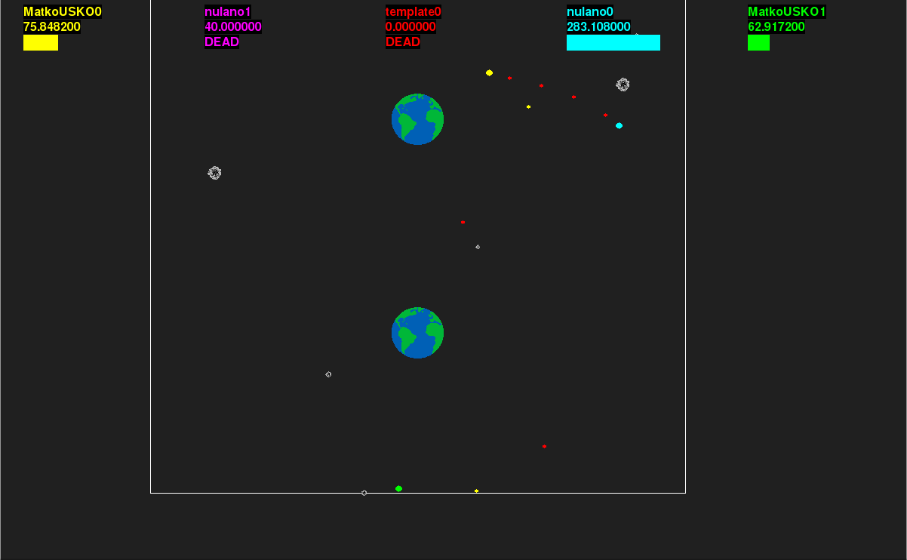

# proboj-2015-jesen

Ak počas návodu dorazíte na nejaké problém, možno ho vyrieši odsek
"Co treba na rozbehanie proboj?" uvedený pri konci README.

## Čo je proboj

Proboj je počítačová hra, ktorej hráčmi nie ste vy, ale programy, čo napíšete.

## Zdrojáky

Štandardný hráč čiže klient (v adresári `klienti/template`) sa skladá z jediného
zdrojáku `main.cpp`. Ale môžte ho rozdeliť aj na viacero.

V serveri je tiež zopár zdrojákov, čo vás bude zaujímať.

- `common.h` obsahuje základné štruktúry, čo váš klient dostane k dispozícii.
- `update.h` obsahuje všetky herné konštanty, a tiež
  implementáciu väčšiny herných pravidiel, takže ak v pravidlách nie je niečo
  jasné, skúste sa tam pozrieť.
- v `main.cpp` sú tiež nejaké pravidlá (ako sa ťahá apod.), ale to je asi menej
  dôležité.

Kľudne si prečítajte aj ostatné zdrojáky, ja sa len poteším, ale pri kódení
vášho klienta vám asi nepomôžu.

## Ako kódiť klienta

Skopírujte obsah `klienti/template` do iného adresára a niečo v ňom nakóďte.

V koreni proboju spustite `make`, čím všetko skompilujete. (Ak váš klient nie je
vnútri `klienti`, nastavte v jeho `Makefile` správny `SERVERDIR` a spustite
`make` aj v ňom.)

Potom spustite `./server/server zaznamy/01 mapy/asteroidy.map klienti/vasklient
klienti/vasklient klienti/template` To spustí hru s troma hráčmi (vaším, druhým
vaším a hlúpym) a uloží záznam do `zaznamy/01`. Ten si môžete pozrieť s príkazom
`./server/observer zaznamy/01`.

Keď server spustíte u vás, je to len na skúšku. Na hlavnom počítači to beží na
ostro. Je tam aj webové rozhranie, cez ktoré môžete uploadovať vašich klientov.
Uploadujú sa zdrojáky v .gz (vypľuté vaším make-om) a tie sa potom skompilujú
(konkrétne sa spustí `make naserveri SERVERDIR=/adresar/kde/je/server`).

## Kde sú sústredkoví botovia?

Nájdete ich v `hlavnykomp/<nazov_klienta>/buildy/<timestamp>`. Kľudne
dajte svojho bota hrať proti nim.

## Co treba na rozbehanie proboja?

Odporucame rozbehavat proboj na linuxe. Na windowse je to bolestive
a nie zdokumentovane, ale ak to date tak vas to urcite posilni...

Na rozbehanie grafickeho rozhrania na pozeranie zapasov ("observer")
su potrebne kniznice SDL-1.2. V repozitari hladajte nasledovne balicky:

`libsdl-gfx1.2-dev libsdl-image1.2-dev libsdl-ttf2.0-dev libsdl1.2-dev`

## Nejake obrazky na zaver

